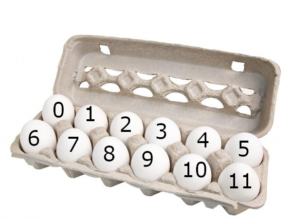
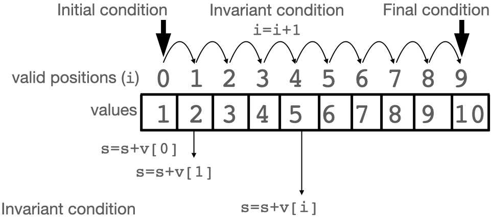
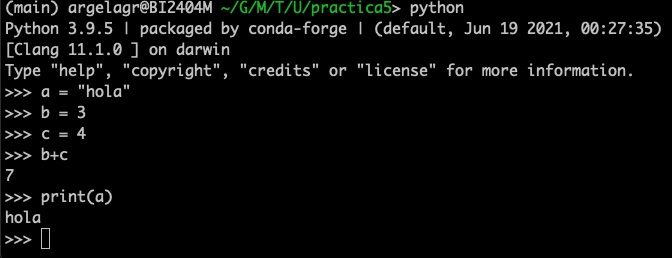
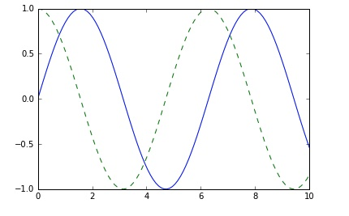
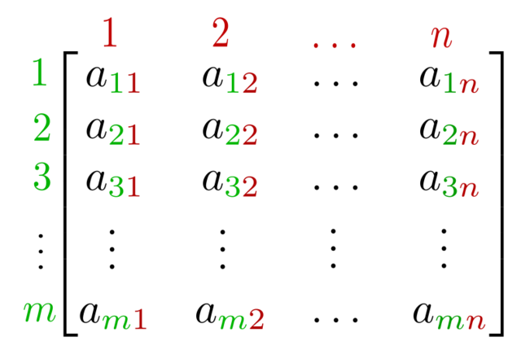
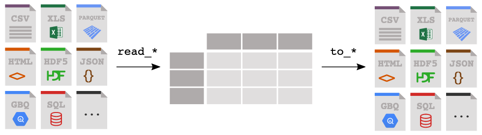
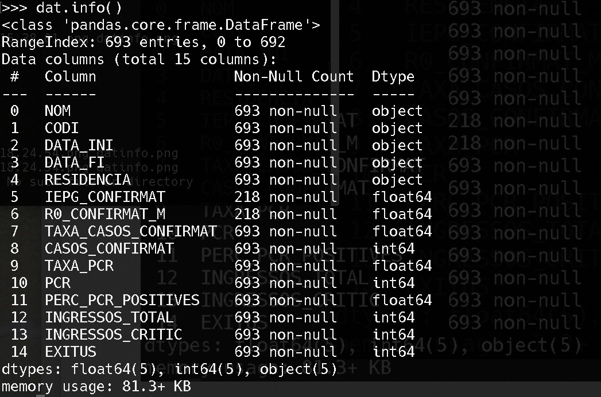
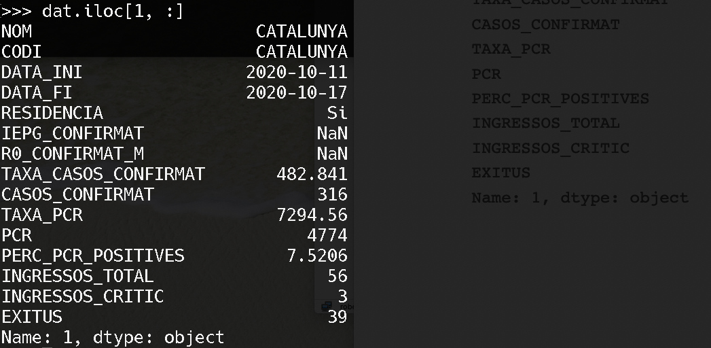

```{r setup, include=FALSE, cache=FALSE}
options(htmltools.dir.version = FALSE, width=80)
knitr::opts_chunk$set(warning = FALSE, message = FALSE, cache=TRUE)

## from http://yihui.name/knitr/hooks#chunk_hooks
knitr::knit_hooks$set(small.mar=function(before, options, envir) {
                                              if (before) par(mar=c(4, 5, 1, 1)) ## smaller margin on top and right
})
```

class: title-slide, middle, center

# Programming with Python (2)

## Robert Castelo
[robert.castelo@upf.edu](mailto:robert.castelo@upf.edu)
### Dept. of Experimental and Health Sciences
### Universitat Pompeu Fabra

<br>

## Fundamentals of Computational Biology
### BSc on Human Biology
### UPF School of Health and Life Sciences
### Academic Year 2021-2022

---

## Vectors

* A vector, or [array](https://en.wikipedia.org/wiki/Array_data_structure) is a
  type of object (variable) that can store more than one single value and allows
  for an indexed access to its values.  
  &nbsp;&nbsp;
* We can set a literal vector into a Python variable using an assignment:
  <pre>
  v = [1, 2, 3, 4, 5]
  </pre>
* We can access its values by referring to one of its **valid positions** in
  the vector.  
  &nbsp;&nbsp;
* Given a vector with $n$ elements, the **valid positions** of a vector in
  Python (and in many other programming languages) go from 0 to $n-1$, that is,
  positions follow a
  [zero-based numbering](https://en.wikipedia.org/wiki/Zero-based_numbering).


.footer[
Image adapted from [Comp 101 Arrays: Overview](https://comp101.org/topics/arrays/arrays-overview).
]

---

## Vectors

* Given the vector:
  <pre>
  v = [1, 2, 3, 4, 5]
  </pre>
* To access the values of `v` using one of its **valid positions**, we will
  use the notation `v[i]`, where `i` is a **valid position**, for instance:
  <pre>
  print(v[0])
  v[0]+v[1]
  i=4
  v[i]
  v[i-1]
  </pre>
<!-- * Vectors are containers for sequences of values contiguous in memory.   -->
* Vectors in programming are analogous to vectors in
  [mathematics and physics](https://en.wikipedia.org/wiki/Vector_%28mathematics_and_physics%29).  
  &nbsp;&nbsp;
<!-- * Filling up vectors with values enables re-using algorithms that operate -->
<!--   on the vector space. This requires looping over valid positions of a vector. -->

---

## Looping over valid positions

* Using an iterative statement, we generate a sequence of valid positions of
  vector that enable looping over valid positions and consequently the access
  to their associated values.

.left-column[
  <pre>
  v = [1, 2, 3, 4, 5, 6, 7, 8, 9, 10]
  i = 0
  s = 0

  while (i < 10) :
  &nbsp;&nbsp;s = s + v[i]
  &nbsp;&nbsp;i = i + 1

  print(s)
  </pre>
]

.right-column[
  &nbsp;&nbsp;  
  &nbsp;&nbsp;
  
]

---

## Looping over valid positions

* Assume we have in the vector `v` a DNA sequence and we want to count
  how many nucleotides `T` we have in this sequence.
<pre>
v = ['A', 'T', 'T', 'G', 'C', 'C', 'T', 'A']
i = 0
n = 0
&nbsp;&nbsp;
while (i < 8) :
&nbsp;&nbsp;if (v[i] == 'T') :
&nbsp;&nbsp;&nbsp;&nbsp;n = n + 1
&nbsp;&nbsp;i = i + 1
&nbsp;&nbsp;
print("there are %d nucleotides T" %(n))
</pre>

---

class: small-table

## Compound conditionals

* Let's say we want to count the number of dinucleotides `TT` in the
  DNA sequence. This requires comparing two consecutive positions in the
  vector, both of which should have the nucleotide `T`.  
  &nbsp;&nbsp;
* We can implement such a logic by nesting
  [conditional statements](https://en.wikipedia.org/wiki/Conditional_%28computer_programming%29).
  However, we can write more compact code with compound conditionals using
  [logical operators](https://en.wikipedia.org/wiki/Logical_connective).  
  &nbsp;&nbsp;
* In Python we have the following three logical operators:

|   Operator          |  Type          | Description                   |
|-------------------- | -------------- | ------------------------------|
|   _cond1_ `and` _cond2_   |  conjunction   | True if both operands are true|
|   _cond1_ `or` _cond2_    |  disjunction   | True if either operand is true|
|   `not` _cond_          |  negation      | True if operand is false      |
* Here _cond_, _cond1_ and _cond2_ refer to logical conditions such as:
  <pre>
  a == 2
  v[i] == 'T'
  i < 10
  </pre>

---

## Compound conditionals

* We can implement the Python program that counts dinucleotides `TT` as follows:
<pre>
v = ['A', 'T', 'T', 'G', 'C', 'C', 'T', 'A']
i = 1
n = 0
&nbsp;
while (i < len(v)) :
&nbsp;&nbsp;if (v[i] == 'T' and v[i-1] == 'T') :
&nbsp;&nbsp;&nbsp;&nbsp;n = n + 1
&nbsp;&nbsp;i = i + 1
&nbsp;
print("there are %d dinucleotides TT" %(n))
</pre>

---

## Concluding remarks (vectors)

* Vectors allow one to store multiple values in a single variable.  
  &nbsp;&nbsp;
* Values in a vector are accessed by their position in the vector.  
  &nbsp;&nbsp;
* Valid positions in a vector in Python start at 0 and consequently end
  at the number of elements minus one.  
  &nbsp;&nbsp;
* Looping over valid positions enables developing algorithms that
  can be re-used by replacing the values of the vector.  
  &nbsp;&nbsp;

---

## Python built-in data types

* What we have called _vectors_ so far are technically called _lists_ in
  Python.  
  &nbsp;&nbsp;
* A _list_ in Python may contain values of different types:
  <pre>
  v = [4, 3.2, "Hello World!", True]
  </pre>
* A _list_ in Python is one of the _built-in_ data types, concretely those
  that can be classified as _sequence data types_:
  * `list`
    <pre>
    v = [4, 3.2, 'Hello World!', True] ## mutable, can change
    </pre>
  * `tuple`: (4, 3.2, 'Hello World!', True)
    <pre>
    v = (4, 3.2, 'Hello World!', True) ## immutable, cannot change
    </pre>
  * `range`: range(5)
    <pre>
    v = range(5) ## sequence of integer numbers from 0 to 5
    </pre>

---

## Python built-in data types

* The whole collection of Python
[built-in data types](https://docs.python.org/3/library/stdtypes.html) is:
  * Text sequence type: `str`
  * Numeric types: `int`, `float`, `complex`
  * Sequence types: `list`, `tuple`, `range`
  * Mapping type: `dict`
  * Set types: `set`, `frozenset`
  * Boolean type: `bool`
  * Binary types: `bytes`, `bytearray`, `memoryview`
* We can figure out the data type of a Python object using the function
  `type()`:
  <pre>
  >>> type("Hello World!")
  &lt;class 'str'&gt;
  >>> type(4)
  &lt;class 'int'&gt;
  >>> type(3.2)
  &lt;class 'float'&gt;
  >>> type(True)
  &lt;class 'bool'&gt;
  </pre>

---

## Functions

A function is a block of organised, *reusable* code that encode a certain algorithm
<pre>
<font style="color: darkblue; font-weight: bold">def</font> sum(a, b):
  &nbsp;&nbsp;c=a+b
  &nbsp;&nbsp;<font style="color: darkblue; font-weight: bold">return</font> c
</pre>  

<pre>
>>> sum(3, 4)
7
</pre>

<pre>
<font style="color: darkblue; font-weight: bold">def</font> subtract(a, b):
  &nbsp;&nbsp;c=a-b
  &nbsp;&nbsp;<font style="color: darkblue; font-weight: bold">return</font> c
</pre>  

<pre>
>>> subtract(3, 4)
-1
</pre>

---

## Functions

Functions can be more complex...
<pre>
<font style="color: darkblue; font-weight: bold">def</font> mean(v):
  &nbsp; c = 0
  &nbsp; i = len(v)-1
  &nbsp; while i>=0:
  &nbsp;&nbsp; c = c + v[i]
  &nbsp;&nbsp; i = i - 1
  &nbsp; mean = c / len(v)
  &nbsp; <font style="color: darkblue; font-weight: bold">return</font> mean
</pre>

<pre>
>>> mean([1,2,3])
2.0
</pre>

---

## Functions

Functions can be more complex...
<pre>
<font style="color: darkblue; font-weight: bold">def</font> Fibonacci(n):
  &nbsp;&nbsp; if n < 0:
  &nbsp;&nbsp;&nbsp;&nbsp;  print("Incorrect input")
  &nbsp;&nbsp; elif n == 0:
  &nbsp;&nbsp;&nbsp;&nbsp; return 0
  &nbsp;&nbsp; elif n == 1 or n == 2:
  &nbsp;&nbsp;&nbsp;&nbsp; return 1
  &nbsp;&nbsp; else:
  &nbsp;&nbsp;&nbsp;&nbsp; result = Fibonacci(n-1) + Fibonacci(n-2)
  &nbsp;&nbsp;&nbsp;&nbsp; <font style="color: darkblue; font-weight: bold">return</font> result
</pre>

<pre>
>>> Fibonacci(9)
34
</pre>

---

## How to execute Python code?

There are two main ways in which you can run a Python program:

* From the Unix shell command line.
<pre>
>>> python script.py
</pre>

* Interactively, through the Python shell interpreter.


---

## Modules

You can import a module (also called a library) following any of the following syntax:
<pre>
>>> import [module_name]
>>> import [module_name] as [alias]
>>> from [module_name] import [entity_name]
</pre>

For example, to use the `sqrt` function from the `math` package
<pre>
>>> import math
>>> math.sqrt(3)
3.0
</pre>

<pre>
>>> import math as m
>>> m.sqrt(3)
3.0
</pre>

<pre>
>>> from math import sqrt
>>> sqrt(3)
3.0
</pre>

---

## Packages (or libraries)

Modules that provide classes and functions to be reused, but that are not
  supposed to be run as standalone applications are called _libraries_ or
  [_packages_](https://docs.python.org/3/tutorial/modules.html#packages).  
  &nbsp;&nbsp;
  
Commonly used Python packages:
* `matplotlib`: for plotting
* `math`: for mathematical operations
* `numpy`: scientific computation
* `sys`: system-specific parameters and functions
* `pandas`: data analysis and manipulation

---

## Importing a Python package

<pre>
import matplotlib.pyplot as plt
import numpy as np
x = np.linspace(0, 10, 100)
plt.plot(x, np.sin(x), '-')
plt.plot(x, np.cos(x), '--');
</pre>



---

## Create your own module

To create a module just save your code in a file with the file extension .py:

For example, let's save a greeting function in a file named `mymodule.py`:

<pre>
def greeting(name):
  print("Bona tarda senyor/a, " + name)
</pre>

Now we can load the module we just created from the Python terminal, by using the `import` statement:

<pre>
>>> import mymodule
>>> mymodule.greeting("Xavi")
Bona tarda senyor/a Xavi
</pre>

---


## Concluding remarks (functions, modules and packages)

* We can make our Python code more modular by defining **functions**

* Python code developed for a particular purpose can be bundled
  together into **modules**
  
* A Python file `.py` can be imported as a module

* Modules that provide classes and functions to be reused, but that are not
  supposed to be run as standalone applications are called 
  **packages** or **libraries**
  
---

## The numpy Python library 

* The [numpy](https://numpy.org) library is a widely used Python library
  for performing numerical calculations with vectors (arrays) and matrices.  
  &nbsp;&nbsp;
* To install the numpy library we can use the `pip` tool:
  <pre>
  $ pip install numpy
  </pre>
* Once installed, we import it using the statement:
  <pre>
  import numpy as np
  </pre>
  where the prefix `np` is the one typically used for the numpy library.


---

## Numeric vectors (1-d arrays) with numpy

* A numpy array is a sequence of values of the same type, i.e., similar to
  the Python built-in `list` type but constraining the values to the same type.  
  
* There are
  [multiple ways](https://numpy.org/doc/stable/user/basics.creation.html#arrays-creation)
  to create numpy arrays, here are some of them:
  
Create an array with predefined values:
<pre>
>>> v = np.array([1, 2, 3, 4, 5])
>>> type(v)
&lt;class 'numpy.ndarray'&gt;
>>> v
array([1, 2, 3, 4, 5])
</pre>

Create an array of zeros:
<pre>
>>> x = np.zeros(10) ## 10 zeroes
>>> x
array([0., 0., 0., 0., 0., 0., 0., 0., 0., 0.])
</pre>
  
---

## Numeric vectors (1-d arrays) with numpy

Create a consecutive range of values:
<pre>
>>> x = np.arange(10)
>>> x
array([0, 1, 2, 3, 4, 5, 6, 7, 8, 9])
</pre>

Create a consecutive range of values (with a step):
<pre>
>>> x = np.arange(0, 1.1, 0.1)
>>> x
array([0. , 0.1, 0.2, 0.3, 0.4, 0.5, 0.6, 0.7, 0.8, 0.9, 1. ])
</pre>

---

## Numeric vectors (1-d arrays) with numpy

The numpy library provides _vectorized_ operations over arrays. For example, let's say we want to multiply a numpy array `x` by the number 10. 
  
* This would be the classical (non-vectorized) operation:
  <pre>
   >>> x
  array([0. , 0.1, 0.2, 0.3, 0.4, 0.5 ])
  >>> i = 0
  >>> v = np.zeros(len(x))
  >>> while (i < len(x)) :
  ...  v[i] = x[i] * 10
  ...  i = i + 1
  >>> v
  array([ 0.,  1.,  2.,  3.,  4.,  5.])
  </pre>
  
* This is the vectorized operation with numpy:
  <pre>
  >>> v = x * 10
  >>> v
  array([ 0.,  1.,  2.,  3.,  4.,  5.])
  </pre>

---

## Numeric vectors (1-d arrays) with numpy

* Basic mathematical operations are _vectorized_ over arrays with numpy:
  <pre>
  >>> v
  array([ 0.,  1.,  2.,  3.,  4.,  5.])
  >>> sum(v)
  55.0
  >>> v - x
  array([0. , 0.9, 1.8, 2.7, 3.6, 4.5])
  </pre>
* We can subset numpy arrays using integer ranges specified with colons `i:j`:
  <pre>
  >>> v[0:3] ## half-open interval, it does not include last item
  array([0., 1., 2.])
  </pre>
* We can also subset numpy arrays using arrays of truth values.
  <pre>
  >>> v[v >= 1]
  array([ 1.,  2.,  3.,  4.,  5.])
  </pre>

---

## Numeric matrices (2-d arrays) with numpy

* A numeric [matrix](https://en.wikipedia.org/wiki/Matrix_%28mathematics%29)
is a two-dimensional array, where numbers are arranged in rows and columns.
  
* We can create a matrix in numpy providing a so-called _shape_ argument that
  defines its dimensions:
  <pre>
  >>> m0s = np.zeros(shape=(3, 3))
  >>> m0s
  array([[0., 0., 0.],
  &nbsp;&nbsp;&nbsp;&nbsp;&nbsp;&nbsp;&nbsp;[0., 0., 0.],
  &nbsp;&nbsp;&nbsp;&nbsp;&nbsp;&nbsp;&nbsp;[0., 0., 0.]])
  </pre>

---

## Numeric matrices (2-d arrays) with numpy

* We can create a matrix in numpy _row-wise reshaping_ a 1-d array.
  <pre>
  >>> m0to8 = v[0:9].reshape(3, 3)
  >>> m0to8
  array([[0., 1., 2.],
  &nbsp;&nbsp;&nbsp;&nbsp;&nbsp;&nbsp;&nbsp;[3., 4., 5.],
  &nbsp;&nbsp;&nbsp;&nbsp;&nbsp;&nbsp;&nbsp;[6., 7., 8.]])
  </pre>
* Vectorized operations apply to matrices as well.
  <pre>
  >>> m1to9 = m0to8 + 1
  >>> m1to9
  array([[1., 2., 3.],
  &nbsp;&nbsp;&nbsp;&nbsp;&nbsp;&nbsp;&nbsp;[4., 5., 6.],
  &nbsp;&nbsp;&nbsp;&nbsp;&nbsp;&nbsp;&nbsp;[7., 8., 9.]])
  </pre>
* We can access specific elements by giving coordinates separated by a comma.
  <pre>
  >>> m1to9[1, 1]
  5.0
  </pre>

---

## Numeric matrices (2-d arrays) with numpy

* We can subset matrices with other arrays placed on the corresponding
  dimension we want to subset.
  <pre>
  >>> i = np.arange(2)
  >>> i
  array([0, 1])
  >>> m1to9
  array([[1., 2., 3.],
  &nbsp;&nbsp;&nbsp;&nbsp;&nbsp;&nbsp;&nbsp;[4., 5., 6.],
  &nbsp;&nbsp;&nbsp;&nbsp;&nbsp;&nbsp;&nbsp;[7., 8., 9.]])
  >>> m1to9[i, :]
  array([[1., 2., 3.],
  &nbsp;&nbsp;&nbsp;&nbsp;&nbsp;&nbsp;&nbsp;[4., 5., 6.]])
  >>> m1to9[:, i]
  array([[1., 2.],
     &nbsp;&nbsp;&nbsp;&nbsp;&nbsp;[4., 5.],
     &nbsp;&nbsp;&nbsp;&nbsp;&nbsp;[7., 8.]])
  </pre>

---

## Concluding remarks (numpy vectors and matrices)

* The Python library numpy enables an efficient use of one-dimensional
  (vectors) and two-dimensional (matrices) arrays.  
  &nbsp;&nbsp;
* Indexing operations on numpy objects are often based in half-open
  intervals where the last item is located one position before the
  specified end.  
  &nbsp;&nbsp;
* Subsetting vectors (1-d arrays) and matrices (2-d arrays) can be
  performed using indexing operations or logical masks.  
  &nbsp;&nbsp;
* Numerical calculations can be performed over entire arrays and
  matrices with one single instruction, enabling _vectorized operations_.

---

## The pandas Python library

* The [pandas](https://pandas.pydata.org) library is a widely used Python
  library for manipulating (reading, transforming, writing, etc.) data files.  
  &nbsp;&nbsp;
* To install the pandas library we can use the `pip`, or `pip3` tool:
  <pre>
  $ pip install pandas
  </pre>
* Once installed, we import it using the statement:
  <pre>
  import pandas as pd
  </pre>
  where the prefix `pd` is the one typically used for the pandas library.


---

## Reading CSV files with pandas

* The pandas library provides a uniform application programming interface (API)
  for reading and writing data in a variety of formats.



.footer[
Image from [pandas documentation](https://pandas.pydata.org/docs/getting_started/intro_tutorials/02_read_write.html#min-tut-02-read-write).
]

---

## Reading CSV files with pandas

* To read a CSV file we call the function `read_csv()`. Here we illustrate it
  with a CSV file from the
  [Catalan COVID19 data portal](https://dadescovid.cat/descarregues?lang=eng):
  <pre><span style="font-size: 14px; white-space: pre; display: inline-block;">
  >>> dat = pd.read_csv("catalunya_setmanal.csv", sep=";")
                NOM       CODI    DATA_INI  ... INGRESSOS_TOTAL INGRESSOS_CRITIC  EXITUS  
  0    CATALUNYA  CATALUNYA  2020-10-11  ...              46                8       1  
  1    CATALUNYA  CATALUNYA  2020-10-11  ...              56                3      39
  2    CATALUNYA  CATALUNYA  2020-10-11  ...             785              146      85
  3    CATALUNYA  CATALUNYA  2020-10-10  ...             752              145      78
  4    CATALUNYA  CATALUNYA  2020-10-10  ...              42                8       1
  ..         ...        ...         ...  ...             ...              ...     ...
  688  CATALUNYA  CATALUNYA  2020-02-25  ...               0                0       0
  689  CATALUNYA  CATALUNYA  2020-02-25  ...               0                0       0
  690  CATALUNYA  CATALUNYA  2020-02-24  ...               0                0       0
  691  CATALUNYA  CATALUNYA  2020-02-24  ...               0                0       0
  692  CATALUNYA  CATALUNYA  2020-02-24  ...               0                0       0
  &nbsp; 
  [693 rows x 15 columns]
  >>> type(dat)
  &lt; class 'pandas.core.frame.DataFrame'&gt;
  </span></pre>
* The `read_*` functions return
  [DataFrame](https://pandas.pydata.org/pandas-docs/stable/reference/api/pandas.DataFrame.html)
objects.

---

## DataFrames in pandas

* We can get a quick glance at the available columns with the function `info()`:



---

## DataFrames in pandas

* We can extract columns from `DataFrames` by using the subset operator `[` on
  the column name.
  <pre>
  >>> dat["RESIDENCIA"]
  0      --
  1      Si
  2      No
  3      No
  4      --
         ..
  688    --
  689    Si
  690    --
  691    Si
  692    No
  Name: RESIDENCIA, Length: 693, dtype: object
  </pre>

---

## DataFrames in pandas

* We can extract columns from `DataFrames` by using the subset operator `[` on
  the `iloc` attribute with a column index.
  <pre>
  >>> dat.iloc&#91:, 4&#93;
  0      --
  1      Si
  2      No
  3      No
  4      --
         ..
  688    --
  689    Si
  690    --
  691    Si
  692    No
  Name: RESIDENCIA, Length: 693, dtype: object
  </pre>

---

## DataFrames in pandas

* We can extract rows from `DataFrames` by using the subset operator `[` on
  the `iloc` attribute with a row index.



---

## DataFrames in pandas

* We can extract rows from `DataFrames` by using the subset operator `[` on
  the `loc` attribute with a logical mask, as follows.
  <pre>
  >>> mask = dat["RESIDENCIA"] == "No"
  >>> mask.sum()
  231
  >>> dat_general = dat.loc[mask, :]
  >>> dat_general.shape
  (231, 15)
  </pre>
* We can write a `DataFrame` object to a CSV file as follows.
  <pre>
  >>> dat_general.to_csv("catalunya_setmanal_general.csv",
                           sep=";", index=False)
  </pre>

---

## DataFrames in pandas

* We can obtain summary statistics by invoking the corresponding function from
  the `DataFrame` column object.
  <pre>
  >>> dat_general["R0_CONFIRMAT_M"].mean()
  1.248674119266055
  </pre>
* We can coerce numerical columns in the `DataFrame` object to numpy arrays to
  use numpy functions on the resulting object, as follows.
  <pre>
  >>> r0 = dat_general["R0_CONFIRMAT_M"].to_numpy()
  >>> np.mean(r0)
  nan
  >>> np.nanmean(r0)
  1.248674119266055
  </pre>

---

## Concluding remarks (pandas DataFrames)

* The Python library pandas provides a uniform application programming
  interface (API) to read and write data from a variety of different formats
  and manipulate its contents.  
  &nbsp;&nbsp;
* The main data container is the `DataFrame` object for which the pandas API
  provides a rich interface that allows one to access, transform and summarize
  the contained data.  
  &nbsp;&nbsp;
* You can coerce columns from a `DataFrame` object to a numpy `array` object,
  thereby enabling using the numpy API on data imported through a `DataFrame`.
